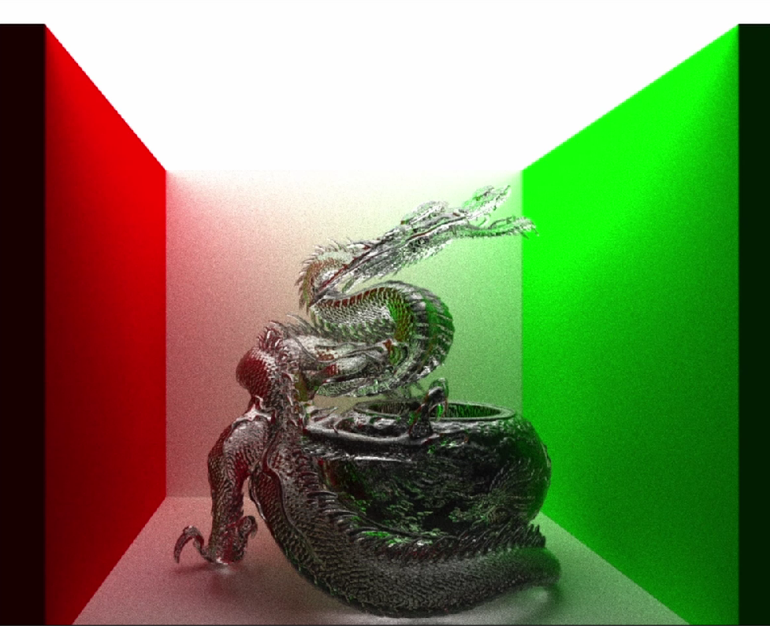
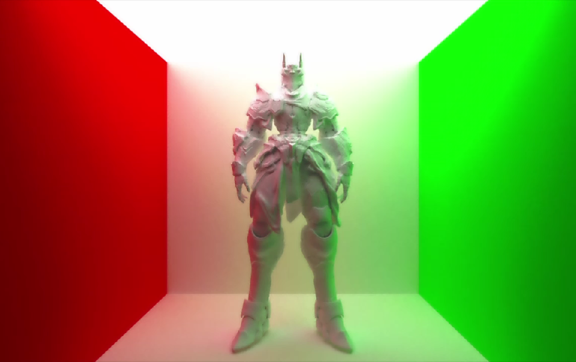
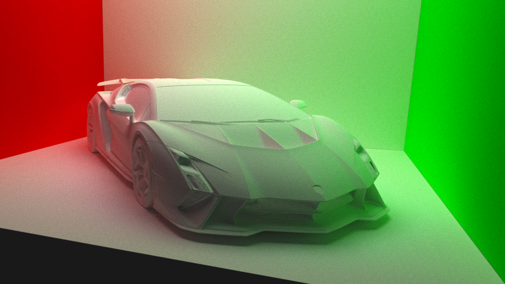
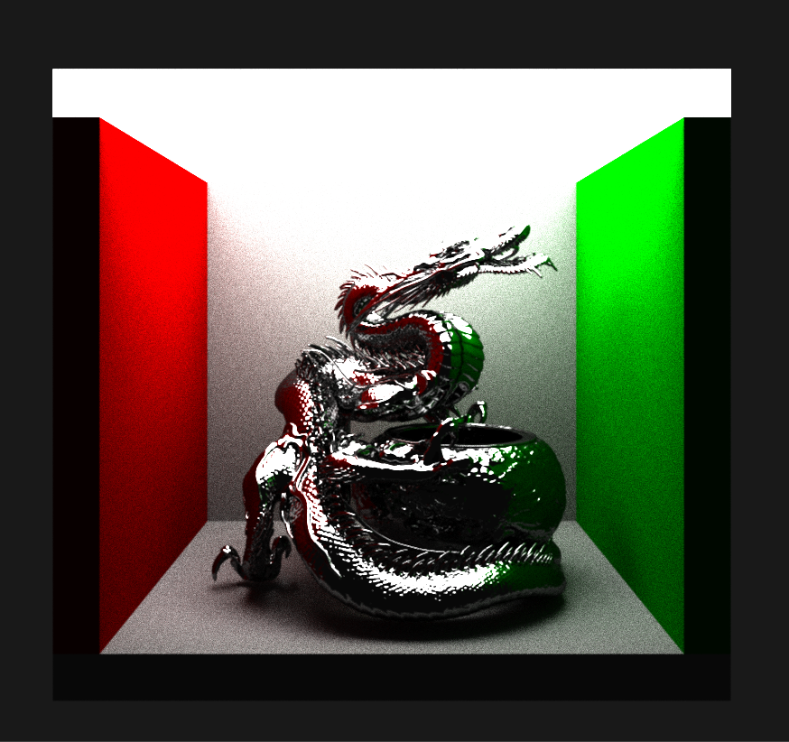
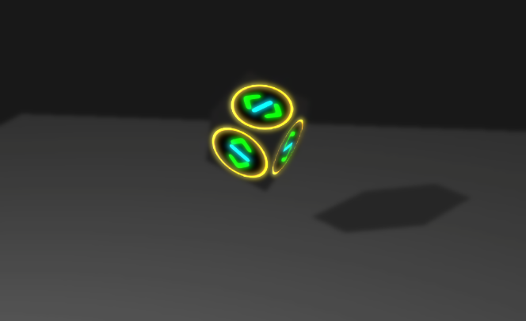
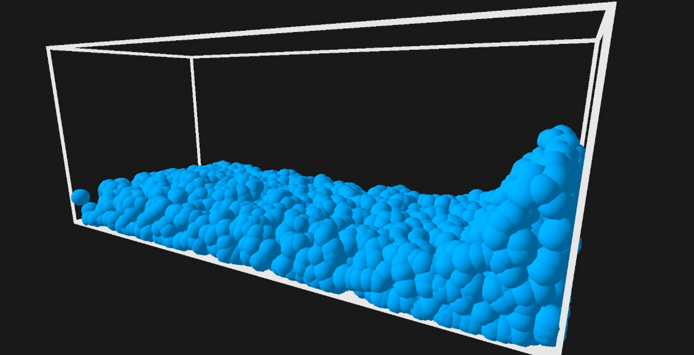

# Neon Engine

## Path Tracer
Implemented physically accurate light simulation with support for multiple material types:

- Specular (mirror reflections)  
- Diffuse (matte surfaces)  
- Glossy (rough reflections)  

---

## Rasterizer
Developed a custom graphics pipeline for real-time rendering:

- Texture mapping  
- Shadow rendering  

---

## Water Simulation (In Progress)
Currently developing a hybrid Euler–Lagrangian water simulation:

- Using FLIP (Fluid-Implicit Particle) to optimize performance  
- Hybrid grid + particle-based simulation  
- Surface generated via ray marching  
- Rendered through ray tracing  

